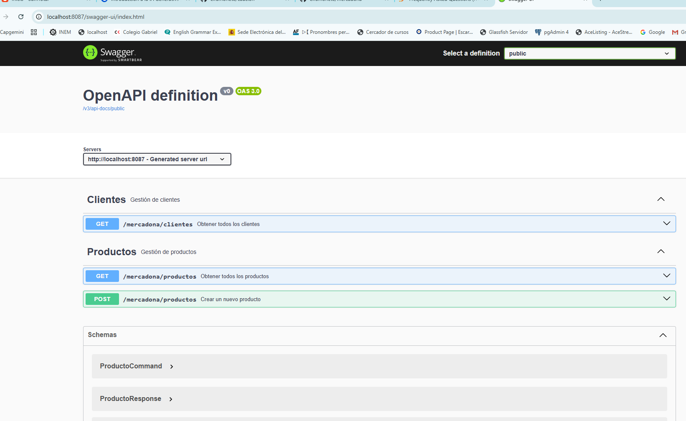
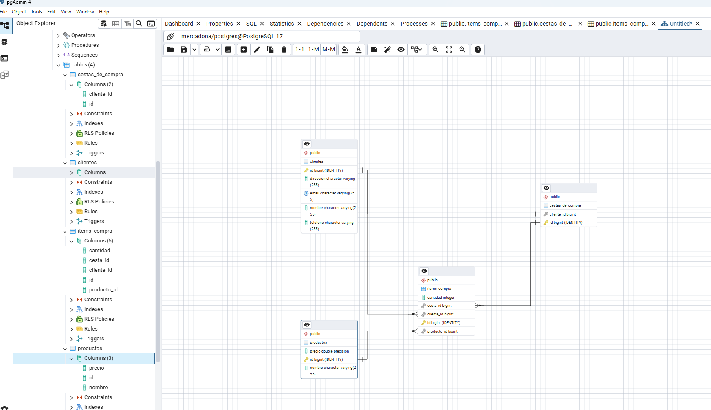
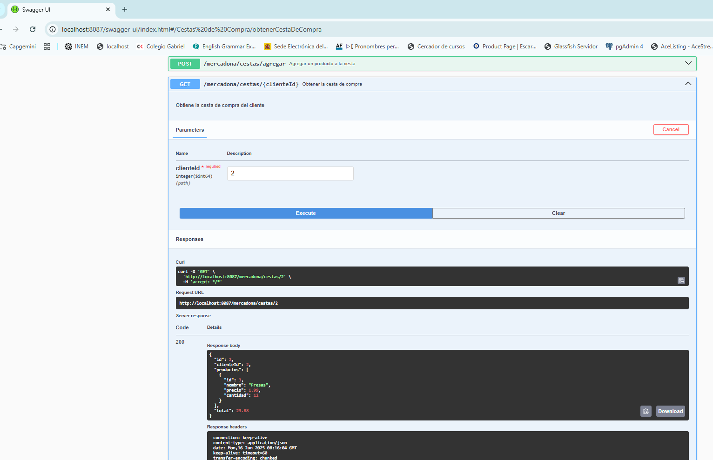
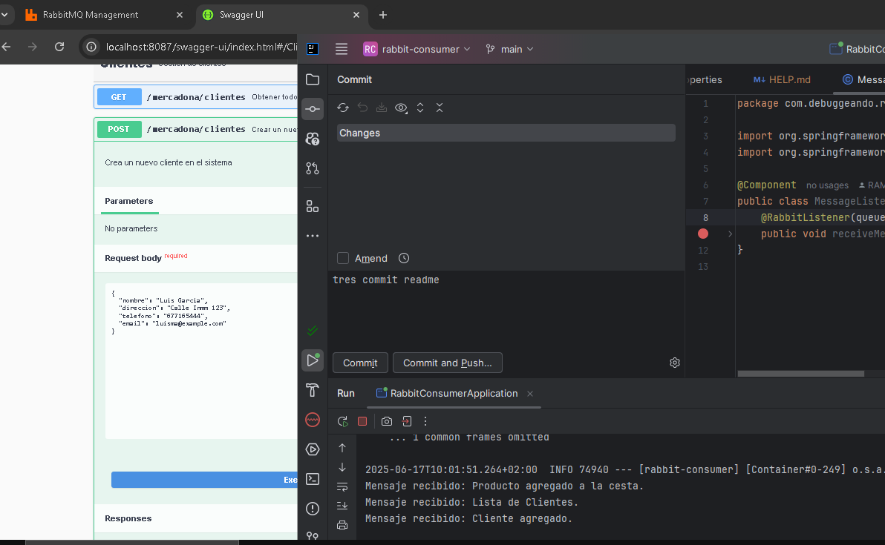
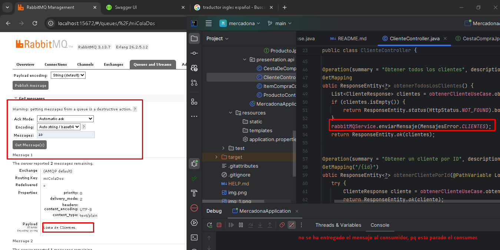

# Proyecto Mercadona

## Descripción

Este proyecto es una aplicación de gestión para clientes y productos del Mercadona, implementada con Spring Boot. La aplicación sigue principios de diseño de software como la arquitectura hexagonal y DDD (Domain-Driven Design), proporcionando una estructura clara y mantenible.

## Tecnologías Usadas

- **Java 21**: La aplicación está desarrollada utilizando Java 21, la última versión estable de Java, que incluye mejoras en el rendimiento y nuevas características del lenguaje.

- **Spring Boot**: Utilizado como framework principal para el desarrollo de la aplicación. Proporciona una configuración fácil y rápida, así como una amplia gama de características para construir aplicaciones web y RESTful.

- **Spring Data JPA**: Facilita la interacción con la base de datos utilizando JPA (Java Persistence API). Proporciona una forma sencilla de implementar repositorios basados en el acceso a datos.

- **Hibernate**: Utilizado como proveedor de JPA para la gestión de la persistencia de datos en la base de datos.

- **MapStruct**: Utilizado para el mapeo entre objetos de transferencia de datos (DTOs) y entidades del dominio, permitiendo una conversión eficiente y sin errores.

- **Lombok**: Utilizado para reducir el código boilerplate en las clases, generando automáticamente métodos como `getters`, `setters`, `equals`, `hashCode`, y `toString`.

- **Swagger**: Herramienta utilizada para la documentación de la API REST. Permite visualizar y probar los endpoints de la API de manera interactiva.

- **WebSocket**: Implementado para permitir la comunicación en tiempo real entre el cliente y el servidor.

- **Spring Kafka**: Integrado para la gestión de colas de mensajes, permitiendo una arquitectura basada en eventos.

## Arquitectura

La arquitectura de la aplicación sigue el patrón **Hexagonal** (también conocido como **Arquitectura de Puertos y Adaptadores**), que permite una separación clara de las preocupaciones y facilita las pruebas. La aplicación se divide en las siguientes capas:

- **Capa de Presentación**: Contiene los controladores REST que manejan las solicitudes del cliente y devuelven respuestas. Aquí se definen los endpoints de la API.

- **Capa de Aplicación**: Contiene la lógica de negocio y los casos de uso de la aplicación. Aquí se implementan las reglas de negocio y se orquestan las interacciones entre las diferentes capas.

- **Capa de Dominio**: Contiene las entidades del dominio (como `Cliente` y `Producto`) y las interfaces de los repositorios. Aquí se define la lógica fundamental de la aplicación.

- **Capa de Infraestructura**: Contiene la implementación de los repositorios que interactúan con la base de datos, así como cualquier otra integración externa (como WebSockets y colas de mensajes).

### Versiones

- **Java**: 21
- **Spring Boot**: [Versión específica que estás utilizando, por ejemplo, 2.6.6]
- **Spring Data JPA**: [Versión específica]
- **Lombok**: [Versión específica]
- **MapStruct**: [Versión específica]
- **Swagger**: [Versión específica]

## Instalación

Para ejecutar este proyecto, asegúrate de tener instalado Java 21 y Maven. Luego, clona el repositorio y ejecuta los siguientes comandos:

```bash
mvn clean install
mvn spring-boot:run
```
### Descripción de la Estructura

- **application/**: Contiene la lógica de aplicación, incluyendo DTOs, mappers y casos de uso (use cases).
- **domain/**: Contiene las entidades del dominio (Cliente, Producto, etc.) y los repositorios que definen las interfaces para el acceso a datos.
- **infrastructure/**: Contiene la implementación de la infraestructura, como la configuración de WebSocket, mensajería (colas), y otras integraciones necesarias.
- **presentation/**: Contiene los controladores REST que manejan las solicitudes de los clientes.
- **resources/**: Contiene archivos de configuración como `application.properties`.
- **test/**: Contiene las pruebas unitarias y de integración para cada capa del proyecto.

http://localhost:8087/swagger-ui.html


---





Añadimos el swagger con la cesta de la compra, con la suma y el resultado Total 



Añadimos las colas de mensajeria RabbitMQ para la lista de productos, de clientes, crear un producto, un cliente y la cesta de la compra



Hacemos un postman para probar obtener los clientes, pero el
servidor del proyecto consumidor, no esta levantado.



### Estructura del Proyecto "mercadona"

```plaintext
mercadona/
├── src/
│   ├── main/
│   │   ├── java/
│   │   │   └── com/
│   │   │       └── product/
│   │   │           └── mercadona/
│   │   │               ├── application/
│   │   │               │   ├── dto/
│   │   │               │   │   ├── ClienteCommand.java
│   │   │               │   │   ├── ClienteResponse.java
│   │   │               │   │   ├── ProductoCommand.java
│   │   │               │   │   ├── ProductoResponse.java
│   │   │               │   │   ├── CestaDeCompraCommand.java
│   │   │               │   │   ├── CestaDeCompraResponse.java
│   │   │               │   │   ├── ItemCompraResponse.java
│   │   │               │   │   └── ItemCompraRequest.java
│   │   │               │   ├── exception/
│   │   │               │   │   ├── cliente/
│   │   │               │   │   │   ├── ClienteAlreadyExistsException.java
│   │   │               │   │   │   └── ClienteNotFoundException.java
│   │   │               │   │   ├── producto/
│   │   │               │   │   │   ├── ProductoAlreadyExistsException.java
│   │   │               │   │   │   └── ProductoNotFoundException.java
│   │   │               │   │   ├── cesta/
│   │   │               │   │   │   └── CestaDeCompraNotFoundException.java
│   │   │               │   │   └── compra/
│   │   │               │   │       └── CompraNotFoundException.java
│   │   │               │   ├── mapper/
│   │   │               │   │   ├── ClienteMapper.java
│   │   │               │   │   ├── ProductoMapper.java
│   │   │               │   │   ├── CestaDeCompraMapper.java
│   │   │               │   │   └── ItemCompraMapper.java
│   │   │               │   └── usecase/
│   │   │               │       ├── borrar/
│   │   │               │       │   ├── BorrarClienteUseCase.java
│   │   │               │       │   └── EliminarProductoDeCestaUseCase.java
│   │   │               │       ├── crear/
│   │   │               │       │   ├── CrearClienteUseCase.java
│   │   │               │       │   ├── CrearProductoUseCase.java
│   │   │               │       │   └── AgregarProductoACestaUseCase.java
│   │   │               │       ├── actualizar/
│   │   │               │       │   ├── ActualizarClienteUseCase.java
│   │   │               │       │   └── ActualizarProductoUseCase.java
│   │   │               │       ├── obtener/
│   │   │               │       │   ├── ObtenerClienteUseCase.java
│   │   │               │       │   ├── ObtenerProductoUseCase.java
│   │   │               │       │   ├── ObtenerCestaDeCompraUseCase.java
│   │   │               │       │   └── ObtenerComprasPorClienteUseCase.java
│   │   │               │
│   │   │               ├── domain/
│   │   │               │   ├── Cliente.java
│   │   │               │   ├── Email.java
│   │   │               │   ├── Producto.java
│   │   │               │   ├── CestaDeCompra.java
│   │   │               │   ├── ItemCompra.java
│   │   │               │   └── repository/
│   │   │               │       ├── ClienteRepository.java
│   │   │               │       ├── ProductoRepository.java
│   │   │               │       ├── CestaDeCompraRepository.java
│   │   │               │       └── ItemCompraRepository.java
│   │   │               │
│   │   │               ├── infrastructure/
│   │   │               │   ├── configuration/
│   │   │               │   ├── messaging/
│   │   │               │   │   └── RabbitMQService.java // Nuevo servicio agregado
│   │   │               │   └── repository/
│   │   │               │       ├── ClienteJpaRepository.java
│   │   │               │       ├── ProductoJpaRepository.java
│   │   │               │       ├── CestaDeCompraJpaRepository.java
│   │   │               │       └── ItemCompraJpaRepository.java
│   │   │               │
│   │   │               └── presentation/
│   │   │                   ├── api/
│   │   │                   │   ├── ClienteController.java
│   │   │                   │   ├── ProductoController.java
│   │   │                   │   ├── CestaDeCompraController.java // Actualizado
│   │   │                   │   └── ItemCompraController.java
│   │   │                   └── ...
│   │   └── resources/
│   │       ├── application.properties
│   │       └── static/
│   └── test/
│       └── java/
│           └── com/
│               └── example/
│                   └── mercadona/
│                       ├── application/
│                       │   ├── CrearClienteUseCaseTest.java
│                       │   ├── BorrarClienteUseCaseTest.java
│                       │   ├── ActualizarClienteUseCaseTest.java
│                       │   ├── ObtenerClienteUseCaseTest.java
│                       │   ├── CrearProductoUseCaseTest.java
│                       │   ├── BorrarProductoUseCaseTest.java
│                       │   ├── ActualizarProductoUseCaseTest.java
│                       │   ├── ObtenerProductoUseCaseTest.java
│                       │   ├── AgregarProductoACestaUseCaseTest.java
│                       │   ├── EliminarProductoDeCestaUseCaseTest.java
│                       │   ├── ObtenerCestaDeCompraUseCaseTest.java
│                       │   ├── RealizarCompraUseCaseTest.java
│                       │   └── ObtenerComprasPorClienteUseCaseTest.java
│                       └── presentation/
│                           ├── ClienteControllerTest.java
│                           ├── ProductoControllerTest.java
│                           ├── CestaDeCompraControllerTest.java
│                           ├── ItemCompraControllerTest.java
│                           ├── BorrarClienteControllerTest.java
│                           ├── ActualizarClienteControllerTest.java
│                           ├── ObtenerClienteControllerTest.java
│                           ├── BorrarProductoControllerTest.java
│                           ├── ActualizarProductoControllerTest.java
│                           ├── ObtenerProductoControllerTest.java
│                           ├── AgregarProductoACestaControllerTest.java
│                           ├── EliminarProductoDeCestaControllerTest.java
│                           ├── ObtenerCestaDeCompraControllerTest.java
│                           ├── RealizarCompraControllerTest.java
│                           └── ObtenerComprasPorClienteControllerTest.java
└── pom.xml
 


